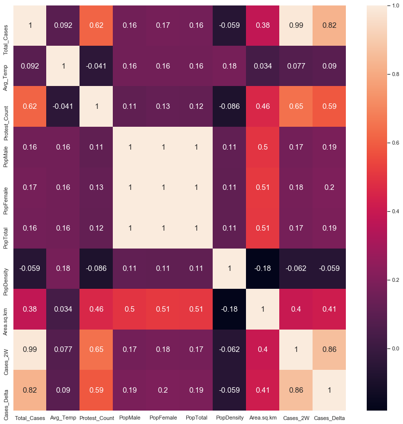

Global Correlation Plot

***The figure above is a correlation plot of all numeric variables for U.S. cases. This was calculated using the correlation coefficient (pearson's). Some interesting correlations related to the total cases include area per square kilometer (.38) and the number of protests (0.62) although the protests are heavily influenced by the US.***

<iframe src="assets/img/Bokeh/Global_Area_Temp.html"
    sandbox="allow-same-origin allow-scripts"
    width="100%"
    height="525"
    scrolling="no"
    seamless="seamless"
    frameborder="0">
</iframe>

***The figure above shows a weak positive correlation between cases and area per square kilometer. An interesting note here is that the countries with the most cases are above average in temperature.***

***You may hover over the bars for more detailed information.***

<iframe src="assets/img/Bokeh/Global_Density_Temp.html"
    sandbox="allow-same-origin allow-scripts"
    width="100%"
    height="525"
    scrolling="no"
    seamless="seamless"
    frameborder="0">
</iframe>

***The figure above shows a surprising little to no correlation between population density and cases. This could be that overall population has more impact than the density.***

***You may hover over the bars for more detailed information.***

<iframe src="assets/img/Bokeh/County_Density_Plot.html"
    sandbox="allow-same-origin allow-scripts"
    width="100%"
    height="525"
    scrolling="no"
    seamless="seamless"
    frameborder="0">
</iframe>

***The figure above shows the top ten countries by cases. Units are in thousands. The top three seem to be significanly higher than the rest.***

 <iframe src="assets/img/Bokeh/Time_Series_Global.html"
    sandbox="allow-same-origin allow-scripts"
    width="100%"
    height="525"
    scrolling="no"
    seamless="seamless"
    frameborder="0">
</iframe>

***The figure above shows the progression of infection rate of the top 5 worst countries. It is interesting to see the US has two peaks whereas the other countries have a consistent progression. Another point is the huge dip from Spain on April 23rd. This can be explained by a correction in the John Hopkins dataset for cases on the 24th.***
