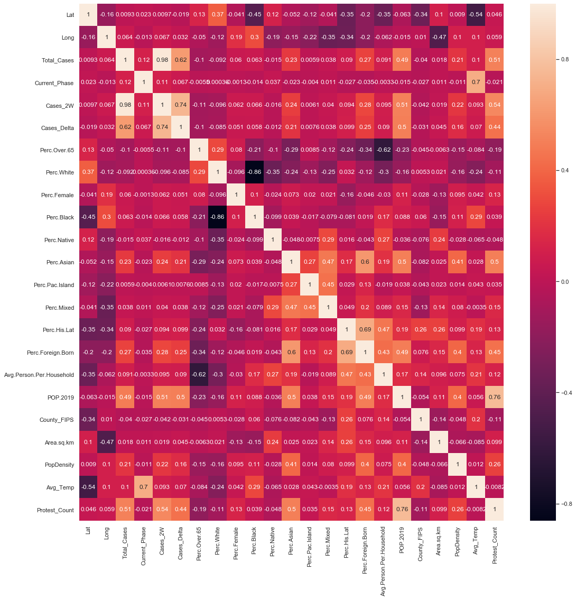

# Descriptive Analytics

## United States Summary

U.S. Correlation Plot

***The figure above is a correlation plot of all numeric variables for U.S. cases. This was calculated using the correlation coefficient (pearson's). Some interesting correlations related to cases (and cases in 2 weeks) are protest count (.51/.54), population (.49/.51), and percent foreign born (.27,.28). It is interesting to point out that most variables had an increased correlation with cases 2 weeks later rather than cases at a given time.***

<iframe src="assets/img/Bokeh/Total_Pop_Plot.html"
    sandbox="allow-same-origin allow-scripts"
    width="100%"
    height="525"
    scrolling="no"
    seamless="seamless"
    frameborder="0">
</iframe>

***The figure above shows the correlation between total covid cases as of June 30th compared to the 2019 population estimate for each county in the US divided by the average person per household. There is a slight positive trend. Something to point out is that the counties with a higher average person per household than the national average (~2.5-2.6) seem to describe most of the outliers.***

***You may hover over points for more detailed information.***

<iframe src="assets/img/Bokeh/BLM_Gov_Cases_Plot.html"
    sandbox="allow-same-origin allow-scripts"
    width="100%"
    height="525"
    scrolling="no"
    seamless="seamless"
    frameborder="0">
</iframe>

***This figure shows the correlation between total cases and the protests divided by the political party of the governer of the state. This seems to again have a slight positive correlation that is smaller than the population correlation. It should also be noted that There is a similar amount of Republican and Democratic outliers.***

***You may hover over points for more detailed information.***

<iframe src="assets/img/Bokeh/County_Density_Plot.html"
    sandbox="allow-same-origin allow-scripts"
    width="100%"
    height="525"
    scrolling="no"
    seamless="seamless"
    frameborder="0">
</iframe>

***The figure above shows the 20 counties with the most cases in the US as of June 30th. It should be noted that the top 2 counties are significatly higher in cases (by at least 40k) than the rest.***

***You may hover over the bars for more detailed information.***

<iframe src="assets/img/Bokeh/Lockdown_Rating_Plot.html"
    sandbox="allow-same-origin allow-scripts"
    width="100%"
    height="525"
    scrolling="no"
    seamless="seamless"
    frameborder="0">
</iframe>

***This figure shows the 20 states with the most cases divided by their restriction ratings. This graph shows there is actually some diversity in the extent to which the lockdown was restrictive. This is likely due to other factors influencing cases especially in larger states.***

***You may hover over the bars for more detailed information.***

<iframe src="assets/img/Bokeh/Time_Series_US.html"
    sandbox="allow-same-origin allow-scripts"
    width="100%"
    height="500"
    scrolling="no"
    seamless="seamless"
    frameborder="0">
</iframe>

***This chart shows the progression of daily cases of the 5 states with the most total cases. Take notice that the y-axis does not represent the number of total cases but the number of new cases. It should be noted that around mid-May is the time California and Florida start a strong postitive trend. Many people may attribute this to moving to phase 2 too early although it is interesting that New York moved to phase 2 around the same timline with more active cases, yet sees a decline while Florida sees an increase. This means phase is likely not the only main factor in predicting cases.***
***You may hover over a line for more detail or click on the legend to filter states.***
